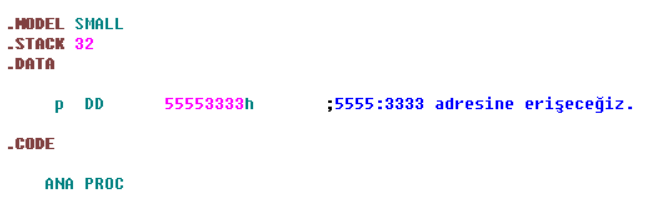

# Python Eğitim İçeriği
_Yapay zeka alanında en önemli yazılım dillerinden bir olan Python için oluşturduğum bu eğitim içeriğinin yeni başlayanlara faydalı olmasını temenni ediyorum._

Tüm elektronik sistemler “0” ve “1” lerden 
oluşan kod bloklarını çalıştırır ve buna  “makine dili” denir.

>
<br>

 Bir adım sonrası ise "Assembly dilleri" olmuştur.
<br>

>
<br>

Ancak yine yeterli olmamaıştır ve bir sonraki adımda **daha anlaşılabilir** programlama dillerinin geliştirilmesi olmuştur.

<br>

```C++
#include<iostream>;
using namespace std;
int main(){
    cout<<"Heollo World!"<<
    endl;
    return0;
}
```
<br> 

Öncelikle en iyi denebilecek bir programlama dili yoktur. Problemin çözümü için algoritmaya uygulanabilecek _en uygun_ programlama dili vardır.

Python dinamik, yüksek seviyeli, _nesne yönelimli_ bir programlama dilidir. Burada yüksek seviyeli olmasından kastımız ise diğer dillere göre anlaşılması en kolay olmasıdır.
   


```python
print("Hello World!")
```
<br>

**PYTHON İLE NELER YAPABİLİRİZ?**

1. Makine öğrenmesi ve yapay zeka 
2. Web uygulamaları
3. Bilimsel hesaplamalar
4. Veri analizi
5. Oyun programlama
6. Mobil Programlama

**PYTHON KURULUMU**
<br>

[Python](https://www.python.org) buradaki linke tıklayarak öncelikle güncel sürmü bilgisayarınıza kurmalısınız.
Uygun path işaretlemesini yapmayı unutmamalısınız.
<br> 
>
<br>

Path (dosya yolu), yani bir dosyanın bir web sitesinin klasör yapısındaki konumunu açıklar. Bu seçim tamalandıktan sonra aşağıdaki görselde yer alan yükleme işlemine devam edilir. 

>

Yükleme işlemi tamamlandıktan sonra komut satırı ile herhangi bir hata olup olmadı kontrol edilir ve güncel versiyon bilgisinin çıktığı elde idildiğinde yükleme işleminin başarılı bir biçimde tamamlandığını anlarız.

>

Daha düzenli ve kolay kod yazmaya devam edebilmek için IDE'ye ihtiyacınız olacaktır.
Burada PyCharm, Atom, Jupyter, Spyder seçenek olabilir. Visual Studio Code'u ücretsiz olarak kullanabilirsiniz.


